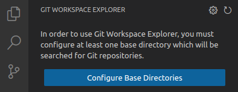
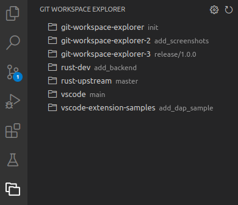

# Git Workspace Explorer

A Visual Studio Code extension which lists all Git repositories from a configurable set of base directories in the activity bar.
You can open these repositories as a workspace in VS Code via a single click.
The current branch name is shown next to the directory name which can be useful if you have multiple working copies of the same project.

## Usage

First configure at least one base directory by clicking on *Configure Base Directories*.

The configured base directories are recursively searched for Git repositories.
The search depth can be limited in the extension settings.
There will be an entry for each found repository in the activity bar.

## License

This work is licensed under the [MIT license](LICENSE.md).
